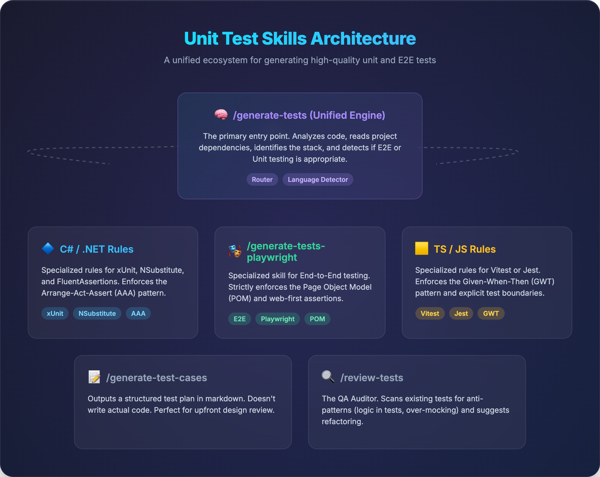

# Unit Test Skills

A collection of AI agent skills for generating high-quality unit tests. These skills encode battle-tested testing principles that work across any programming language, with specialized rules for C#/.NET (xUnit, NSubstitute, AwesomeAssertions) and TypeScript/JavaScript (Vitest or Jest). Skill output quality is measured by an in-repo evaluation harness with committed scorecards.

## Installation

### Option 1: Using openskills (Recommended)

[openskills](https://github.com/numman-ali/openskills) automatically generates `AGENTS.md` for maximum AI agent effectiveness.

```bash
# Install skills
npx openskills install quanglewin/testing-skills

# Auto-generate/update AGENTS.md with installed skills
npx openskills sync
```

**Why openskills?** According to [Vercel's research](https://vercel.com/blog/agents-md-outperforms-skills-in-our-agent-evals), skills alone trigger only 53% of the time. With `AGENTS.md`, success rate jumps to **100%**.

### Option 2: Using npx skills

```bash
npx skills add quanglewin/testing-skills
```

Or install specific skills:

```bash
npx skills add quanglewin/testing-skills --skill generate-test-cases
npx skills add quanglewin/testing-skills --skill generate-tests
```

> **Note:** the repo-internal `eval-skills` and `improve-skill` live under `internal/` and are never installed (installers consume `skills/` only). Pin to a release tag for reproducible installs.

For Claude Code specifically:

```bash
npx skills add quanglewin/testing-skills -a claude-code
```

**Important:** After installing with `npx skills`, manually add the snippet from [`templates/AGENTS-SNIPPET.md`](templates/AGENTS-SNIPPET.md) to your project's `AGENTS.md` file.

## Why AGENTS.md Matters

| Configuration | Success Rate |
|---------------|--------------|
| Skills alone | 53% |
| Skills + prompting | 79% |
| **AGENTS.md** | **100%** |

`AGENTS.md` provides persistent context to AI agents on every turn, without requiring them to decide to load skills first. See the [full article](https://vercel.com/blog/agents-md-outperforms-skills-in-our-agent-evals) for details.

## Skill Architecture



## Available Skills

| Skill | Command | Description |
|-------|---------|-------------|
| Generate Tests | `/generate-tests <target>` | Full workflow (Unified Engine): analyzes code, outputs test cases for review, then generates unit test code. Automatically detects and supports **C#/.NET** (xUnit, NSubstitute, AwesomeAssertions) and **TypeScript/JavaScript** (Vitest/Jest). |
| Generate E2E Tests | `/generate-tests-playwright <target>` | Specialized workflow for **Playwright testing — E2E browser flows, Component, and API**. Enforces Page Object Model (POM) and web-first assertions. |
| Generate Test Cases | `/generate-test-cases <target>` | Analysis only: outputs a structured list of test cases in AAA or Given-When-Then format without writing any code. Useful for test planning. |
| Review Tests | `/review-tests <target>` | Automated QA Auditor: scans existing test files for anti-patterns (logic in tests, over-mocking, hidden setup) and suggests refactoring based on Google TotT best practices. |

## Usage

### Generate Tests (Primary Skill)

```
/generate-tests src/Services/OrderService.cs
/generate-tests src/services/order-service.ts
```

This single command handles the full workflow:
1. Analyzes the source code and outputs a structured list of test cases
2. Asks you to review the test cases before proceeding
3. Generates the actual test files
4. Verifies compilation

### Analyze Test Coverage Only

If you only want to see what test cases are needed without generating code:

```
/generate-test-cases src/Services/OrderService.cs
```

## Testing Principles

These skills enforce proven testing practices:

### General Rules (All Languages)

| Rule | Description |
|------|-------------|
| **Test Case Strategy** | Strict INCLUDE/EXCLUDE criteria - test each code branch, not collection sizes |
| **Naming Conventions** | `{method}_{state}_{outcome}` format for clarity |
| **AAA / Given-When-Then** | Clear structure with `actual`/`expected` prefixes (Arrange-Act-Assert in C#, Given-When-Then in TS/JS) |
| **Keep Tests Focused** | One scenario per test, single responsibility |
| **Test Behaviors** | Test what it does, not how it's implemented |
| **No Logic in Tests** | KISS > DRY - use literal values, avoid calculations |
| **Clean Test Data** | Use helpers and builders, never rely on defaults |
| **Cause-Effect Clarity** | Setup belongs in the test, not in distant shared setup (constructor/`beforeEach`) |
| **Public APIs First** | Test through public interfaces, not private methods |
| **Verify Relevant Args** | Match only relevant arguments; `Arg.Any<T>()` / `expect.anything()` for the rest |

### Language-Specific Rules

#### C# / .NET
- xUnit + NSubstitute + AwesomeAssertions
- **Arrange-Act-Assert (AAA)** structure comments — the .NET convention
- Constructor = per-test setup (xUnit creates a new instance per test)
- **FORBIDDEN:** `WebApplicationFactory`, `TestServer`, Testcontainers in unit tests
- Capture DTOs with `Arg.Do<T>`/`Arg.Is<T>` instead of `Arg.Any<T>` in `Received()`
- Raw string literals (`"""…"""`) for JSON (no `JsonSerializer.Serialize` in tests)
- `FakeLogger` for log verification (`ILogger` extension methods can't be substituted)
- Controllers: direct instantiation + `ActionResult` type assertions

#### TypeScript / JavaScript
- Vitest or Jest — detected per project, APIs never mixed
- DI-first mocking: inject fakes/`vi.fn()` objects; module mocking is the fallback
- **FORBIDDEN:** snapshot tests for logic (change-detector tests)
- Always `await` async assertions (`await expect(...).rejects.toThrow(...)`)
- Fake timers (`vi.useFakeTimers()`) instead of real waits; no `done()` callbacks
- Typed mocks — no `as any` on test doubles

## Project Structure

```
skills/
├── generate-test-cases/
│   ├── SKILL.md
│   └── rules/general/
├── generate-tests/
│   ├── SKILL.md
│   └── rules/tests/
│       ├── general/
│       ├── csharp/unit/
│       ├── typescript/unit/
│       └── post-generation/
├── generate-tests-playwright/   # draft — not yet harness-evaluated
│   ├── SKILL.md
│   └── rules/playwright/
│       ├── api/
│       ├── component/
│       └── general/
└── review-tests/
    └── SKILL.md
internal/
├── eval-skills/          # repo-internal: score skill output against the harness
└── improve-skill/        # repo-internal: propose rule improvements from eval results
harness/                  # eval-only fixtures + rubric + scorecards (never installed)
specs/                    # design specs
```

Only skills under `skills/` are installed into user projects. `internal/` and `harness/` are repo-development machinery.

## Quality Harness

Skill quality is not assumed — it is measured. The `harness/` directory contains small fixture projects (.NET and TypeScript) with hand-derived golden test-case lists and a 6-dimension scoring rubric (`harness/rubric.md`):

| Dimension | Gate |
|---|---|
| Compiles | HARD — run fails |
| Tests pass | HARD |
| Golden-case recall | ≥ 0.90 |
| EXCLUDE-rule precision | 0 violations |
| Forbidden patterns | 0 hits |
| Convention compliance | ≥ 0.90 |

- `/eval-skills` — runs `generate-tests` cold-start against each fixture and writes a scorecard to `harness/results/`
- `/improve-skill` — runs the eval, classifies failures, proposes minimal rule edits as a reviewable PR (never auto-merges)

Latest run (2026-07-30, run 2 — post-Java-removal rules): **both ecosystems PASS** — C# 13/13 tests with AAA comments confirmed, TS 15/15 tests, recall 1.00 both, zero forbidden patterns, zero fix attempts needed.

## Test Case Generation Strategy

### INCLUDE
- Each distinct code branch and outcome
- Each unique return value or exception
- Separate cases for HTTP 400, 401, 403 (never merge)
- Negative test cases for validation constraints
- All paths through private methods (via public API)

### EXCLUDE
- Duplicate scenarios with same observable result
- Collection size variations (1, 2, 3 items) unless code has explicit size logic
- Speculative cases (exotic Unicode, massive payloads) unless explicitly handled
- Null arguments unless the parameter is nullable (`T?`)
- Multiple tests for same exception type

## Example Output

### Test Cases
```
## Test Cases for OrderService.CalculateTotal

### 1. CalculateTotal_ValidProducts_ReturnsSum
- **Given:** List with products priced at 50.0m and 100.0m
- **When:** CalculateTotal() is called
- **Then:** Returns 150.0m
- **Code branch:** Happy path

### 2. CalculateTotal_EmptyList_ThrowsArgumentException
- **Given:** Empty product list
- **When:** CalculateTotal() is called
- **Then:** Throws ArgumentException
- **Code branch:** Validation - empty input
```

### Generated Test (C#)
```csharp
public class OrderServiceTests
{
    private readonly IProductRepository _productRepository = Substitute.For<IProductRepository>();
    private readonly OrderService _orderService;

    public OrderServiceTests()
    {
        _orderService = new OrderService(_productRepository);
    }

    [Fact]
    public void CalculateTotal_ValidProducts_ReturnsSum()
    {
        // Arrange
        var products = new List<Product> { new("A", 50.0m), new("B", 100.0m) };
        _productRepository.FindAll().Returns(products);

        // Act
        decimal actualTotal = _orderService.CalculateTotal();

        // Assert
        decimal expectedTotal = 150.0m;
        actualTotal.Should().Be(expectedTotal);
    }
}
```

### Generated Test (TypeScript)
```typescript
describe('OrderService', () => {
  describe('calculateTotal', () => {
    it('calculateTotal_validProducts_returnsSum', () => {
      // Given
      const productRepository = {
        findAll: vi.fn().mockReturnValue([
          { name: 'A', price: 50 },
          { name: 'B', price: 100 },
        ]),
      };
      const orderService = new OrderService(productRepository);

      // When
      const actualTotal = orderService.calculateTotal();

      // Then
      const expectedTotal = 150;
      expect(actualTotal).toBe(expectedTotal);
    });
  });
});
```

## Contributing

Contributions are welcome via Pull Requests. All PRs require review and approval from maintainers before merging.

When adding new rules:

1. Place general rules in `skills/{skill-name}/rules/general/` (or `rules/tests/general/` for generate-tests)
2. Place language-specific rules in `skills/generate-tests/rules/tests/{language}/unit/`
3. Update skill files if new rules need explicit reference
4. Ensure your changes follow the existing format and style

## Contribution Workflow

Changes land via Pull Requests:
- Create a feature branch, open a PR against `main`
- CODEOWNERS (`.github/CODEOWNERS`) are requested for review automatically
- Run `/eval-skills` on the affected ecosystem before merging rule changes — the scorecard is the status check

## Rules & Best Practices

The testing rules encoded in these skills are derived from:
- **The Art of Unit Testing** (Roy Osherove)
- **Google's Testing on the Toilet** series (2007-2024)

For a consolidated list of the Do's and Don'ts implemented by the unit-test generation skills (`generate-tests` / `generate-test-cases`), please refer to our **[BEST_PRACTICES.md](BEST_PRACTICES.md)** document. It does not yet cover `generate-tests-playwright` or `review-tests`.

## Guide to Building Skills for Claude
[The Complete Guide to Building Skills for Claude](https://resources.anthropic.com/hubfs/The-Complete-Guide-to-Building-Skill-for-Claude.pdf)

